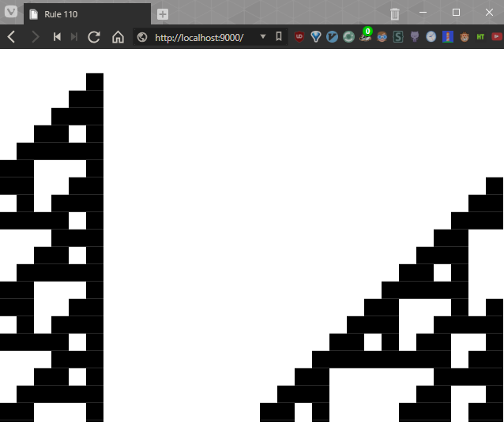

# Rule 110

An implementation of the Turing-complete Rule 110 monodimensional cellular automaton in JS and canvas.

Any key will toggle play/pause.
Clicking will toggle a cell's living state.

Note: The board is cyclic. The size of a square is a constant number of pixel. The board will occupy as much space as possible.

## Trying it

1) You'll need NodeJS and NPM
1) Clone this repository and open a terminal in it
1) Run `npm install` (or `npm i`)
1) Run `npm run dev`
1) Go to http://localhost:9000

## Todo

* Make the canvas auto-resize when the window is resized
* Allow speed changes using the mouse and keyboard, rather than having to open up the JS console
* Adapt the size of the squares so that it fits the screen perfectly
* The way squares appear at the bottom is not very beautiful, it could be improved; maybe add a grid too
* It would be good to provide a way to choose either the number of squares per line, or the size of each square

* Propose another implementation, where dead cells don't use any space and the living cells only know about the location of the next living cell